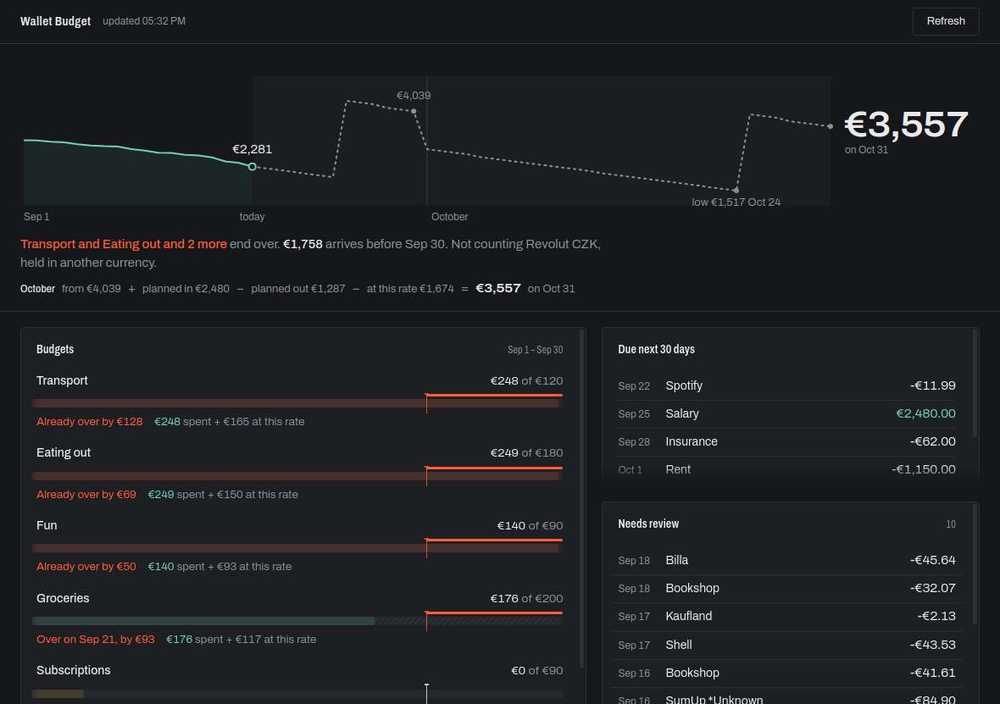

# Wallet Budget Widget

A desktop dashboard for BudgetBakers Wallet: budgets with end-of-period
projections, a month balance runway, upcoming standing orders, bank-sync
freshness, and an uncategorized inbox. Windows notifications for orders coming
due and budgets crossing their limits.

Read-only. It never modifies Wallet data.



## Setup

Requires a Wallet **Premium** subscription. Generate a personal API token in
Wallet web under Settings → API, then paste it on first launch. The token is
encrypted with Windows DPAPI via Electron's `safeStorage` and stored in
`%APPDATA%/wallet-budget-widget/state.json`. It is never sent anywhere except
`rest.budgetbakers.com`, and never crosses into the renderer process.

```bash
npm install
npm start
```

## Build a portable exe

```bash
npm run build      # -> dist/WalletBudgetWidget-0.1.0.exe
```

## Tests

```bash
npm test
```

Tests cover the pure modules — `rrule`, `forecast`, `alerts`, `snapshot`,
`poll`, `store`, `secrets`, `api` — plus two rules the renderer has to keep:
the `[hidden]` override, and no style attributes anywhere (the window runs
under `style-src 'self'`, which refuses them without an error the user can
see). The Electron shell itself is not tested.

## Looking at the UI

`test/preview.html` is the real renderer driven by a fixed snapshot in
`test/fixture-snapshot.js`, under the same content policy as the real window.
Open it in a browser to work on the dashboard without a token. It is not
packaged — `electron-builder` ships `renderer/`, not `test/`.

Regenerate the fixture with `node test/make-fixture.js`. It runs sample data
through the real `snapshot.build()`, so the preview cannot drift into showing
a shape the renderer never receives.

## Reading the budget rows

Each row is one scale. The graduation is that budget's limit, and it sits at
the same place in every row, so the column reads top to bottom as a single
instrument. The bar runs the three terms of the projection end to end —
solid for what is spent, brass for standing orders still to land, hatched for
what the current rate adds — and stops where the month is projected to end.
A bar that crosses the graduation is a budget that ends over, and the run past
it is marked. The line under it says when: the days are walked one at a time,
so a budget that a rent payment tips over on the 28th says the 28th rather
than spreading the overshoot across the month.

Type is Archivo, bundled in `renderer/fonts/`. Nothing is fetched at runtime.

## How the projection works

```
projected = spent            what Wallet already reports for the period
          + scheduled        standing orders whose RRULE lands before period end
          + discretionary    mean daily non-recurring spend x days remaining
```

Keeping `scheduled` separate from `discretionary` is what makes the number
trustworthy. A budget made entirely of subscriptions has no daily burn rate —
its remaining charges are known exactly — while a food budget is nothing but
burn rate. Each row shows the three terms that produced its number.

The balance line is the same arithmetic applied to money rather than to one
budget's scope. It runs from the start of this month to the end of **next**
month: measured up to today, then every standing order on its own date plus
the everyday burn rate on every day. That last term is what makes the far end
mean anything — a line that only books the payments it knows the date of
drifts upward, and the longer the horizon the more it flatters you.

Two months in view moves where the news is. The end of the line stops being
the worst point once payday lifts it again, so the low point in between is
marked, and the day the balance would reach zero is marked in the alarm
colour. Next month's arithmetic is written out under the plot: this month's
closing balance, plus what is planned in, minus what is planned out, minus
what the rate adds up to.

This is arithmetic, not prediction. The discretionary term assumes the trailing
window is representative of the rest of the period, and it will be wrong for
irregular spending.

## Known limits

- **No bank-sync history.** The API exposes no sync log or last-sync timestamp,
  so the sync panel reports the age of each account's newest bank record as a
  proxy for freshness.
- **Review state, not rules.** "Needs review" lists records Wallet reports as
  `uncleared` or `waitForAssign` — imported but never confirmed. The API
  exposes no categorisation rules, so a record a rule got wrong looks the same
  as one it got right; only an unconfirmed record is visible.
- **No server-side aggregation.** Rollups are computed locally from `/records`.
- **Rate limit.** 300 requests/hour sustained. The default 5-minute poll uses
  roughly 72/hour and backs off automatically when the remaining budget is low.
